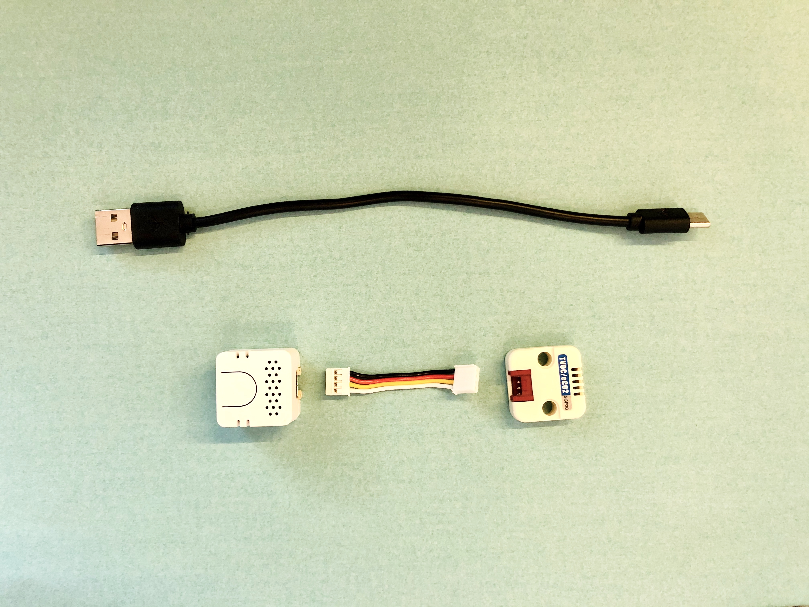
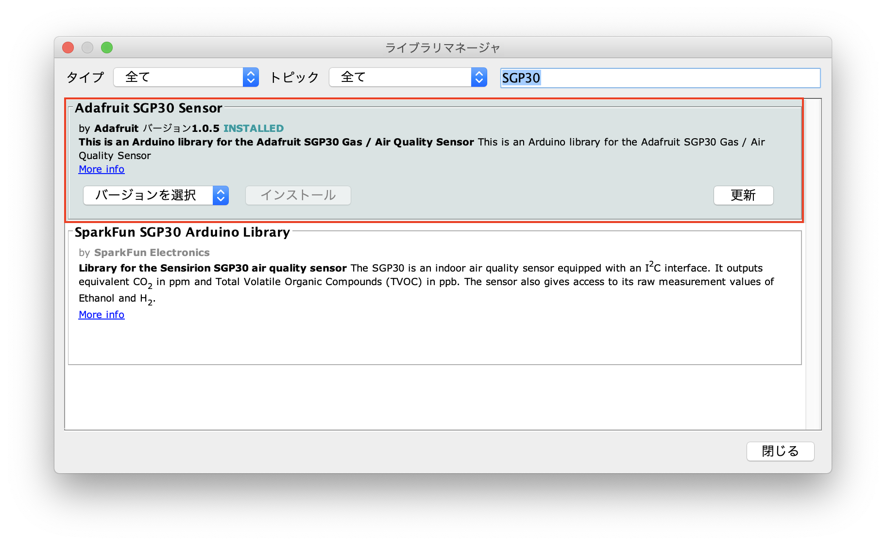

# [Ventilation Alert] AtomEcho_SGP30 【作り方ドキュメント】
ATOM EchoとSGP30を使って作るCO2換気アラートデバイスの作り方を紹介します。

**ソースコードは別リポジトリです [https://github.com/panasonic-corporation/dio-ventilation-alert](https://github.com/panasonic-corporation/dio-ventilation-alert)**

  
<strong>注意) 使用するセンサーSGP30はガスセンサーで、空気の汚れなどを示すVOC値を測定し、そこから等価二酸化炭素濃度（eCO2）を計算して出力するものであるため、正確なCO2濃度を計測できるものではありません。温度や湿度によっても影響される上、アルコールなどにも反応するため、あくまでも目安として使用してください。より正確に測定できるCO2センサーを用いた作り方も今後紹介する予定です。</strong> 

# 作り方

## 1 準備

### 必要なパーツを用意

|     | 部品名                |  販売リンク（例）                                                   | 備考 |
|:----:|:---------------------|:----------------------------------------------------------------|:----|
|  1  | ATOM Echo              |[SwitchScience](https://www.switch-science.com/catalog/6347/) | |
|  2  | USB2.0ケーブル（A-Type Cタイプ） | [SwitchScience](https://www.switch-science.com/catalog/3792/) | |
|  3  | TVOC/eCO2 ガスセンサユニット（SGP30） |[SwitchScience](https://www.switch-science.com/catalog/6619/)||
|  4  | HY2.0 ケーブル ||TVOC/eCO2 ガスセンサユニット（SGP30）に付属|

★ 参考価格（総額） : 約2,827円（税込み）

## 2 電子部品の接続

### 2.1 ガスセンサユニット に HY2.0ケーブルを接続する

### 2.2 ATOM Echo に HY2.0ケーブルを接続する

### 2.3 ATOM Echo に USB Cableを接続する

### 2.4 完成

## 3 開発環境のダウンロードとインストール

下記リンクを参考に開発環境をインストールしてください。

https://github.com/panasonic-corporation/doingio-base-docs/blob/master/README.md#a-m5stack%E9%96%8B%E7%99%BA%E7%92%B0%E5%A2%83%E3%81%AE%E3%83%80%E3%82%A6%E3%83%B3%E3%83%AD%E3%83%BC%E3%83%89%E3%81%A8%E3%82%A4%E3%83%B3%E3%82%B9%E3%83%88%E3%83%BC%E3%83%AB

## 4 ライブラリをダウンロードとインストール

### 4.1 ”スケッチ” → ”ライブラリをインクルード” → ”ライブラリを管理”「SGP30」と検索して「Adafruit SGP30 Sensor」をインストール  

## 5 ファームウェアのダウンロードと実行

### 5.1  ファームウェアのダウンロード
ファームウェアをダウンロードしてください
https://github.com/panasonic-corporation/doingio-ventilation-alert

### 5.2 プロジェクトを開く
フォルダを開き、doingio-ventilation-alert/AtomEcho_SGP30Unit/AtomEcho_SGP30Unit.ino をダブルクリックしてArduino IDEで開きます。

### 5.4 設定
ATOM EchoとPCをUSBケーブルで接続し、Arduino IDEの「ツール」タブを開き下記の通り設定します。

### 5.5 書き込み

### 5.6 動作確認
USBケーブルを電源に差すと起動します。
センサーに息を吹きかけ、本体のLEDが赤く光り音が鳴ることを確認してください。  

## 6. 筐体（ケース）の製作
ケースは皆さんのアイディアで自由に作ってみましょう！

作ったケースはハッシュタグ #dio_product でTwitterやInstagramなどでどんどんシェアしてください！

[筐体（ケース）の作り方](./howto_make_body_ja.md)

 
 
 
 

<h1>完成！</h1>

 
 
 
 

# 使い方

1. 電源を入れる

    USB TypeCケーブルをUSBの電源に接続すれば自動で起動します。

    

2. アラート音を選択する

    中央のプッシュスイッチを押すと、アラート時に再生される音が変わります。

    | 再生される音 |
    |-------|
    |鳥のさえずり|
    |電子音1|
    |電子音2|

3. 設置する

    室内のCO2濃度を正しく計測するため、人の息が直接かからない場所に設置してください。
    壁コンセントから直接USBに接続して常に電源が供給されている状態にしておきましょう。

    

4. 使ってみる

    アラートが出たら窓を開けたり換気扇を回して換気を行いましょう。

    アラートが連続して再生されないよう、CO2濃度が1,000ppmを超えた後、一度800ppmを下回らない限り再びスピーカーから音が再生されることはありません。

    LEDは0〜599ppmで緑、
    LEDは600〜799ppmで黄色、
    LEDは800ppm以上で赤 に光ります。
