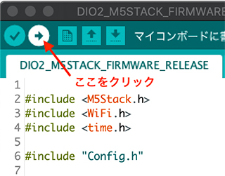

Language : [jp](./M5StickC_SGP30_jp.md) | en
# [Ventilation Alert] M5StickC_SGP30
How to make a CO2 ventilation alert device using M5StickC and SGP30

**[Source code for Ventilation Alert Device is HERE](https://github.com/panasonic-corporation/dio-ventilation-alert)**
  
<strong>
Caution: The device does not measure accurate CO2 concentration since the SGP30 sensor used for the device is a gas sensor for measuring the VOC value that indicates air quality, and the equivalent carbon dioxide concentration (eCO2) is calculated based on this value. The value may be affected by temperature and humidity, and senses also alcohol and other factors, and the device is for reference purposes only. A recipe for a device with a more accurate CO2 sensor will be coming in the future.
</strong> 

# How to make it

## Tutorial Video is also available
<a href="https://www.youtube.com/watch?v=azzayRNOW5U"></a>

## 1. Preparetion

### Prepare the required parts.


|     | Product name                | Photo |  Retailer link（example）                                                   | Note |
|:----:|:---------------------|:---:|:----------------------------------------------------------------|:----|
|  1  | M5StickC              | |[SWITCH SCIENCE](https://www.switch-science.com/catalog/6350/), [Marutsu online](https://www.marutsu.co.jp/pc/i/1526331/), [Digi-Key](https://www.digikey.com/product-detail/en/m5stack-technology-co-ltd/K016-C/2221-K016-C-ND/10492141) | |
|  2  | USB Cable Type C | || Included with M5StickC |
|  3  | M5StickC Speaker Hat  | |[SWITCH SCIENCE](https://www.switch-science.com/catalog/5754/), [Marutsu online](https://www.marutsu.co.jp/pc/i/1556456/), [Digi-Key](https://www.digikey.com/product-detail/en/m5stack-technology-co-ltd/U055/2221-U055-ND/11200926)    ||
|  4  | SGP30 | |[SWITCH SCIENCE](https://www.switch-science.com/catalog/6619/), [Marutsu online](https://www.marutsu.co.jp/pc/i/31309791/), [Digi-Key](https://www.digikey.com/products/en?mpart=101020512)||
|  5  | GROVE Cable | ||Included with SGP30|

#### Required materials
- Double-sided tape

## 2. Connecting electronic components

### 2.1 Connect the SGP30 to the GROVE Cable.


### 2.2 Connect the M5StickC to the GROVE Cable.


### 2.3 Place double-sided tape on the SGP30, and peel off the protective paper.


### 2.4 Affix the SGP30 on the M5StickC.


### 2.5 Connect the M5StickC to the M5StickC Speaker Hat.


### 2.6 Connect the M5StickC to the USB Cable.


### 2.7 Completed.


## 3. Program writing

Install the development enviroment on your PC as shown below.

https://github.com/panasonic-corporation/doingio-base-docs/blob/master/README.md#a-m5stack%E9%96%8B%E7%99%BA%E7%92%B0%E5%A2%83%E3%81%AE%E3%83%80%E3%82%A6%E3%83%B3%E3%83%AD%E3%83%BC%E3%83%89%E3%81%A8%E3%82%A4%E3%83%B3%E3%82%B9%E3%83%88%E3%83%BC%E3%83%AB

## 4 Download / Install the Libraries

### 4.1 ”Sketch” → ”Include Library” → ”Manage Libraries” Search "SGP30" and install "Adafruit SGP30 Sensor"  


## 5 ファームウェアのダウンロードと実行

### 5.1  ファームウェアのダウンロード
ファームウェアをダウンロードしてください
https://github.com/panasonic-corporation/doingio-ventilation-alert


### 5.2 プロジェクトを開く
フォルダを開き、doingio-ventilation-alert/M5StickC_SGP30/M5StickC_SGP30.ino をダブルクリックしてArduino IDEで開きます。

### 5.4 設定
M5StickCとPCをUSBケーブルで接続し、Arduino IDEの「ツール」タブを開き下記の通り設定します。


### 5.5 書き込み


### 5.6 Rebooting M5StickC
Reboot M5StickC when the writing is completed.


(This step is unnecessary if it reboots automatically after the writing is completed.)


Press and hold the push switch on the side of the M5 mark for 6 seconds to turn off the power.  
After waiting a few seconds, press and hold the same push switch for 2 seconds to turn on the power.  


### 5.7 Operation Check
When power is turned on, the M5StickC displays a measured CO2 value.  
Blow on the sensor, and confirm that the sound and the red LED light on the M5StickC body are activated when the level exceeds 1,000 ppm.  
  


## 6. Make a cover (body)

Build your own cover with flexible ideas! 

Share your cover on Twitter and Instagram with the hashtag #dio_product.

Make a cover as shown below.

[How to make a cover](./howto_make_cover_en.md)


<br>
<br>
<br>
<br>
<center><h1>Complete!</h1></center>
<br>
<br>
<br>
<br>

# How to use

1. Power on

    Connect the USB Type C cable to the USB power connector. The program starts up automatically.  

    

2. Select alert sound

    Press the “M5” push switch on M5StickC to change the alert sound.  

    | Displayed name | Sound |
    |-------|-------|
    |Twitter| Bird chirping |
    |Electric| Electric sound |
    |Charmela| Suona tune |

3. Install

    In order to measure the indoor CO2 concentration correctly, place the device in an area that is not directly exposed to human breath. M5StickC is equipped with a small built-in battery, which lasts for up to several dozen minutes without a power supply, when fully-charged. However, to ensure continuous operation, the USB should be directly plugged in to a wall outlet to obtain a continuous power supply.

    

4. Use

    When an alert is activated, ventilate the area by opening windows or turning on exhaust fans.

    The alert does not continue to sound. After the CO2 concentration exceeds 1,000 ppm, the audible alert will be reactivated only after the concentration first falls below 700 ppm. (The LED light stays on until it falls below 700 ppm.)

# 【For Creators】 Software Improvement and Modification
The D+IO Project allows users to modify and upgrade the recipes. Use your creativity to update the D+IO PRODUCTS. We look forward to your suggestions for fixing code and making improvements posted on PullRequest and Issue.

### About Audio Data
Convert audio data to wav unsigned 8-bit data, and add a hexadecimal array as a variable. Below are sample commands of a conversion command using ffmpeg, and a command to output a hexadecimal array using xxd.

#### Unsigned 8-bit conversion（ffmpeg）
```
# sample command
$ ffmpeg -i input.wav -vn -ac 1 -ar 16000 -acodec pcm_u8 -f wav output.wav
```

#### Output a hexadecimal array（xxd）
```
# sample command
$ xxd -i output.wav > sample_data
```