Language : jp | [en](./M5StickC_SGP30_en.md)
# [Ventilation Alert] M5StickC_SGP30 【作り方ドキュメント】
M5StickCとSGP30を使って作るCO2換気アラートデバイスの作り方を紹介します。


**CO2換気アラートデバイスのソースコードは別リポジトリです<br>[https://github.com/panasonic-corporation/dio-ventilation-alert](https://github.com/panasonic-corporation/dio-ventilation-alert)**

  
<strong>注意) 使用するセンサーSGP30はガスセンサーで、空気の汚れなどを示すVOC値を測定し、そこから等価二酸化炭素濃度（eCO2）を計算して出力するものであるため、正確なCO2濃度を計測できるものではありません。温度や湿度によっても影響される上、アルコールなどにも反応するため、あくまでも目安として使用してください。より正確に測定できるCO2センサーを用いた作り方も今後紹介する予定です。</strong> 


# 作り方

## 作り方動画も公開しています
<a href="https://www.youtube.com/watch?v=rLuye3YrSfk"></a>

## 1 準備

### 必要なパーツを用意


|     | 部品名                | 画像 |  販売リンク（例）                                                   | 備考 |
|:----:|:---------------------|:---:|:----------------------------------------------------------------|:----|
|  1  | M5StickC              | 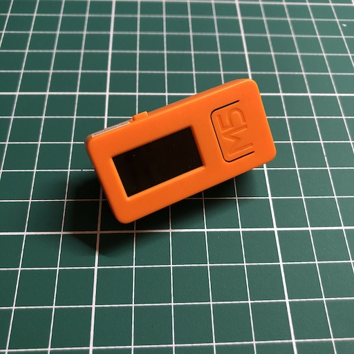|[スイッチサイエンス](https://www.switch-science.com/catalog/6350/), [マルツオンライン](https://www.marutsu.co.jp/pc/i/1526331/), [Digi-Key](https://www.digikey.com/product-detail/en/m5stack-technology-co-ltd/K016-C/2221-K016-C-ND/10492141) | |
|  2  | USB Cable Type C | 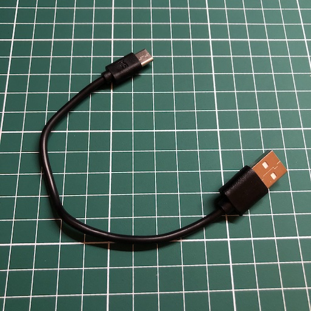|| M5StickCに付属 |
|  3  | M5StickC Speaker Hat  | 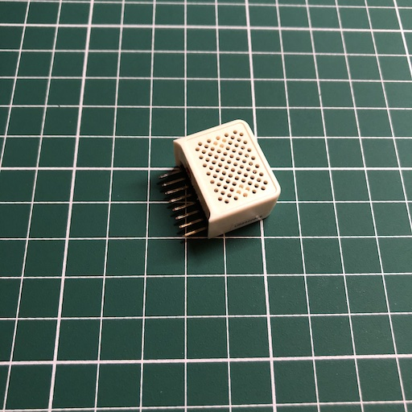|[スイッチサイエンス](https://www.switch-science.com/catalog/5754/), [マルツオンライン](https://www.marutsu.co.jp/pc/i/1556456/), [Digi-Key](https://www.digikey.com/product-detail/en/m5stack-technology-co-ltd/U055/2221-U055-ND/11200926)    ||
|  4  | GROVE - VOC AND ECO2 GAS SENSOR (SGP30) | 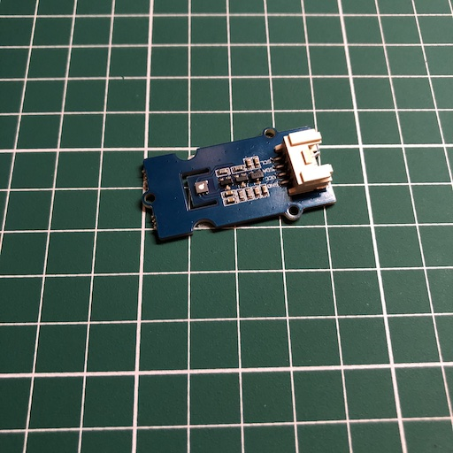|[スイッチサイエンス](https://www.switch-science.com/catalog/6619/), [マルツオンライン](https://www.marutsu.co.jp/pc/i/31309791/), [Digi-Key](https://www.digikey.com/products/en?mpart=101020512)||
|  5  | GROVE Cable | 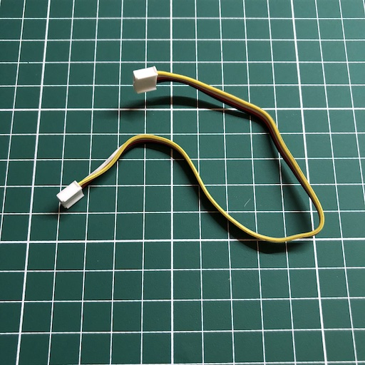||GROVE - VOC AND ECO2 GAS SENSOR (SGP30)に付属|
★参考価格（総額） : 3,542円（税込み）

#### 必要な道具
- 両面テープ

## 2 電子部品の接続

### 2.1 SGP30 と GROVE Cableを接続する
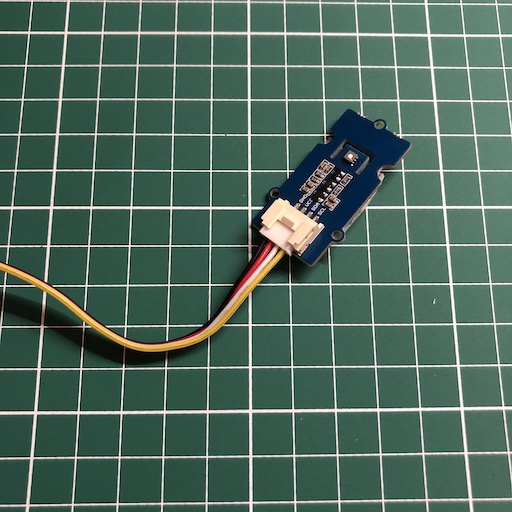

### 2.2 M5StickC と GROVE Cableを接続する


### 2.3 SGP30 に両面テープを貼り、表面を剥がす
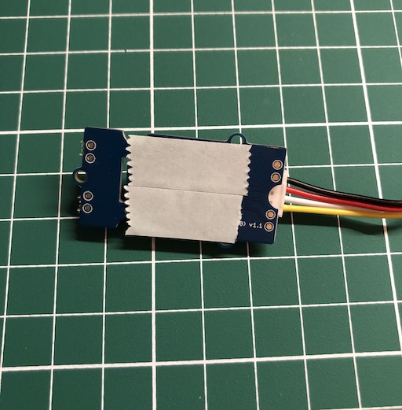


### 2.4 SGP30 を M5StickC に貼り付ける
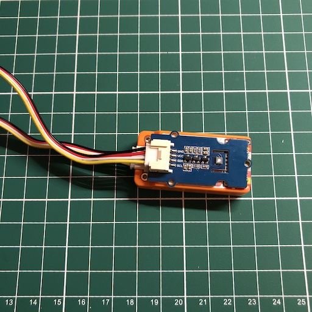

### 2.5 M5StickC に M5StickC Speaker Hat を接続する
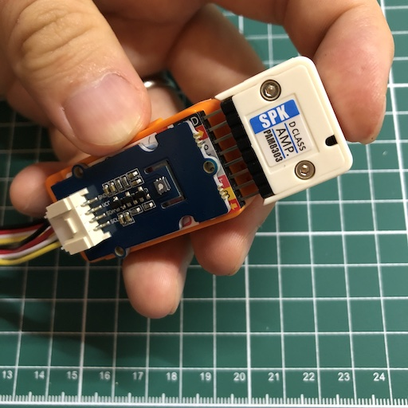

### 2.6 M5StickC に USB Cableを接続する
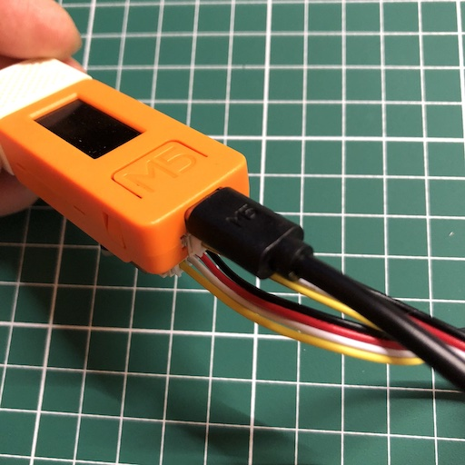

### 2.7 完成


## 3 開発環境のダウンロードとインストール

下記リンクを参考に開発環境をインストールしてください。

https://github.com/panasonic-corporation/doingio-base-docs/blob/master/README.md#a-m5stack%E9%96%8B%E7%99%BA%E7%92%B0%E5%A2%83%E3%81%AE%E3%83%80%E3%82%A6%E3%83%B3%E3%83%AD%E3%83%BC%E3%83%89%E3%81%A8%E3%82%A4%E3%83%B3%E3%82%B9%E3%83%88%E3%83%BC%E3%83%AB

## 4 ライブラリのダウンロードとインストール

### 4.1 ”スケッチ” → ”ライブラリをインクルード” → ”ライブラリを管理”「SGP30」と検索して「Adafruit SGP30 Sensor」をインストール  


## 5 ファームウェアのダウンロードと実行

### 5.1  ファームウェアのダウンロード
ファームウェアをダウンロードしてください
https://github.com/panasonic-corporation/doingio-ventilation-alert


### 5.2 プロジェクトを開く
フォルダを開き、doingio-ventilation-alert/M5StickC_SGP30/M5StickC_SGP30.ino をダブルクリックしてArduino IDEで開きます。

### 5.4 設定
M5StickCとPCをUSBケーブルで接続し、Arduino IDEの「ツール」タブを開き下記の通り設定します。


### 5.5 書き込み


### 5.6 M5StickCの再起動
書き込みが完了したらM5StickCを再起動します。

（書き込み完了後に自動的に再起動されたらこのステップは不要です。）  

M5マーク側面のプッシュスイッチを6秒長押しして電源をOFFにしてください。  
その後数秒待ってから、同じプッシュスイッチを2秒長押しして電源をONにしてください。   


### 5.7 動作確認
電源を入れるとM5StickCのディスプレイにCO2の計測結果が表示されます。  
センサーに息を吹きかけ、1000ppmを超えると音が鳴り、M5StickC本体のLEDが赤く光ることを確認してください。  
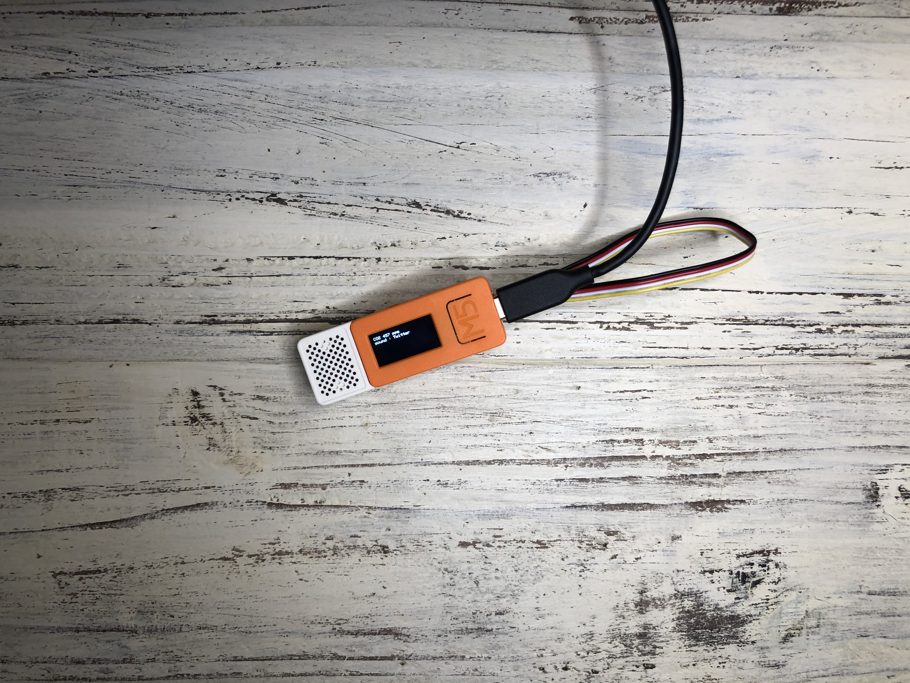  
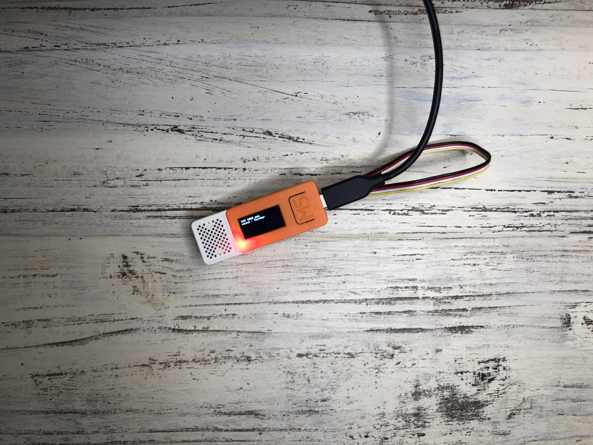


## 6. 筐体（ケース）の製作
ケースは皆さんのアイディアで自由に作ってみましょう！

作ったケースはハッシュタグ #dio_product でTwitterやInstagramなどでどんどんシェアしてください！

下記リンクを参考にケースを作りましょう。

[筐体（ケース）の作り方](./howto_make_cover_ja.md)


<br>
<br>
<br>
<br>
<center><h1>完成！</h1></center>
<br>
<br>
<br>
<br>

# 使い方

1. 電源を入れる

    USB TypeCケーブルをUSBの電源コネクタに接続すればプログラムが自動で起動します。

    

2. アラート音を選択する

    M5StickCの「M5」と書かれているプッシュスイッチを押すと、アラート時に再生される音が変わります。

    | 表示名 | 再生される音 |
    |-------|-------|
    |Twitter|鳥のさえずり|
    |Electric|電子音|
    |Charmela|チャルメラ|

3. 設置する

    室内のCO2濃度を正しく計測するため、人の息が直接かからない場所に設置してください。
    M5StickCに小さいバッテリーが内蔵されているので、フル充電状態から電源を繋がなくても数十分は稼働しますが、常に稼働させるために壁コンセントから直接USBに接続して常に電源が供給されている状態にしておきましょう。

    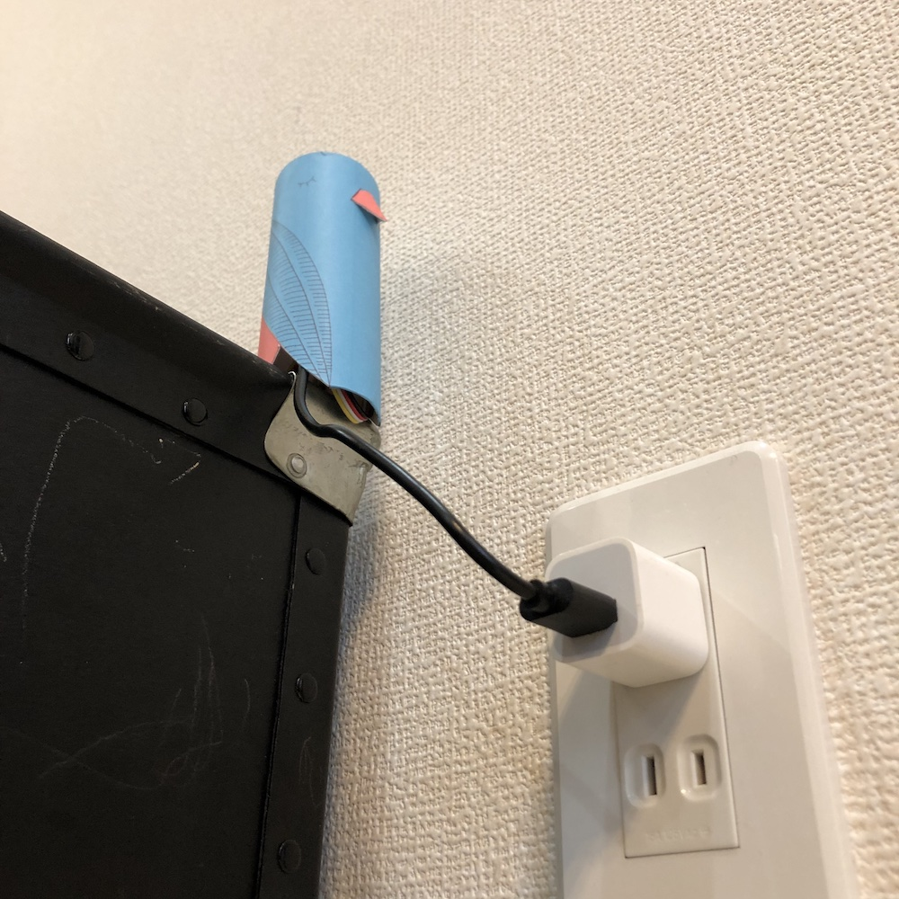

4. 使ってみる

    アラートが出たら窓を開けたり換気扇を回して換気を行いましょう。

    アラートが連続して再生されないよう、CO2濃度が1,000ppmを超えた後、一度700ppmを下回らない限り再びスピーカーから音が再生されることはありません。 (LEDは700ppmを下回るまで光り続けます。)


# 【クリエイター向け】 ソフトウェアの改善、修正
D+IOプロジェクトではユーザ自身がレシピを修正したり、アップグレードさせることができます。
あなたのクリエイティブ力でD+IO PRODUCTをアップデートさせていきましょう。
コードの修正や改善案など、PullRequestやIssueへの投稿をお待ちしています。

### 音声データについて
音声データはwavの符号なし8bitデータに変換し、16進数の配列を変数として持たせます。
例としてffmpegを利用した変換コマンドとxxdで16進数の配列を出力するコマンド例を示します。

#### 符号なし8bit変換（ffmpeg）
```
# コマンド例
$ ffmpeg -i input.wav -vn -ac 1 -ar 16000 -acodec pcm_u8 -f wav output.wav
```

#### 16進数配列を出力（xxd）
```
# コマンド例
$ xxd -i output.wav > sample_data
```