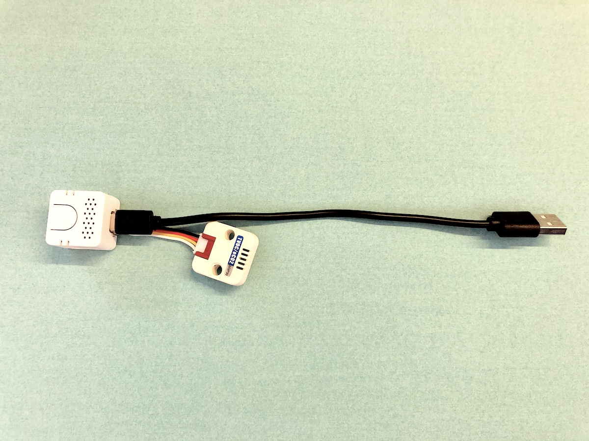

| Project Name | 画像 | MCU | Sensor | 補足 |
|--------|--------|--------|--------|--------|
|[M5StickC_SGP30](./M5StickC_SGP30_ja.md)|  | M5StickC | SGP30 | 注意) 使用するセンサーSGP30はガスセンサーで、空気の汚れなどを示すVOC値を測定し、そこから等価二酸化炭素濃度（eCO2）を計算して出力するものであるため、正確なCO2濃度を計測できるものではありません。温度や湿度によっても影響される上、アルコールなどにも反応するため、あくまでも目安として使用してください。|
|[AtomEcho_SGP30](./AtomEcho_SGP30_ja.md) |  | ATOM Echo | SGP30 | 注意) 使用するセンサーSGP30はガスセンサーで、空気の汚れなどを示すVOC値を測定し、そこから等価二酸化炭素濃度（eCO2）を計算して出力するものであるため、正確なCO2濃度を計測できるものではありません。温度や湿度によっても影響される上、アルコールなどにも反応するため、あくまでも目安として使用してください。|

