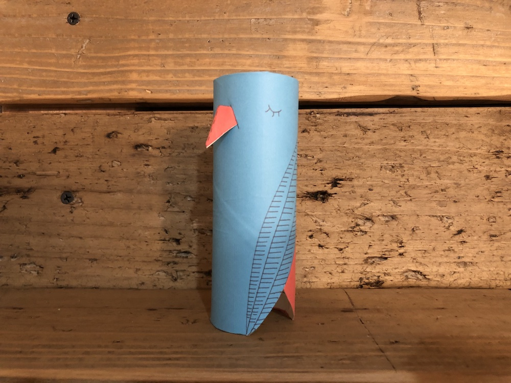
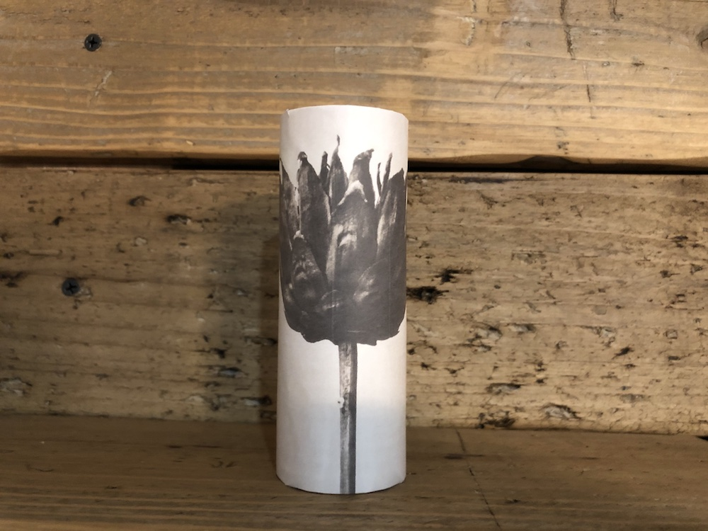
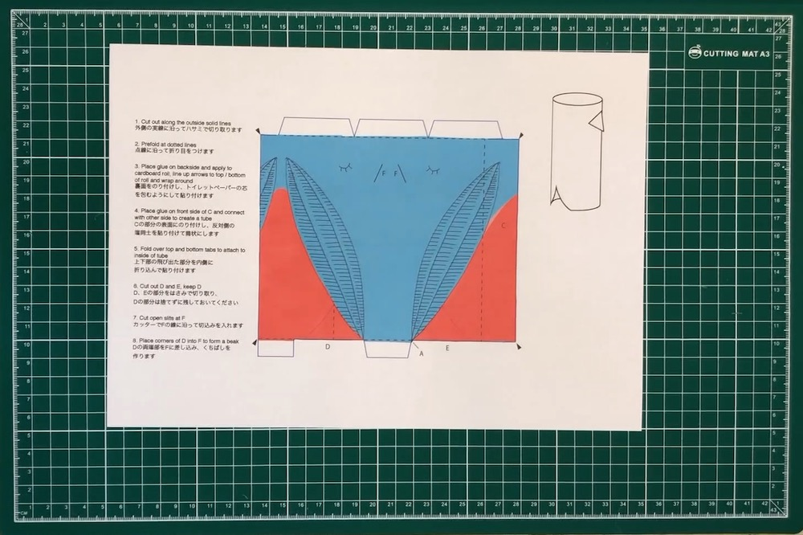
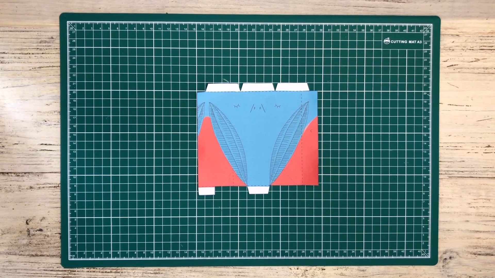
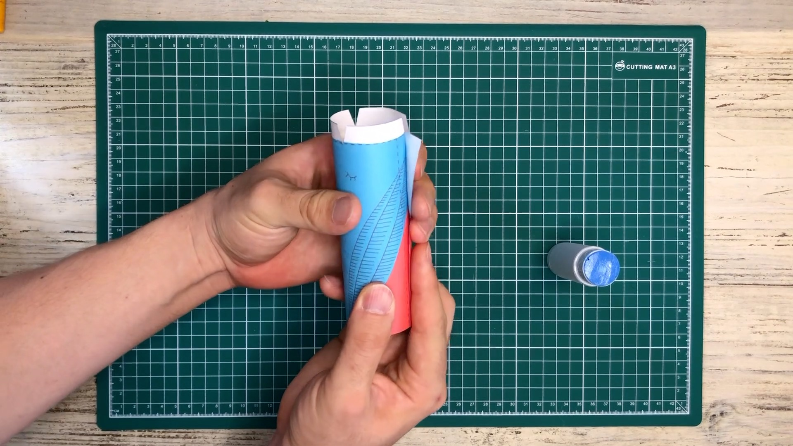
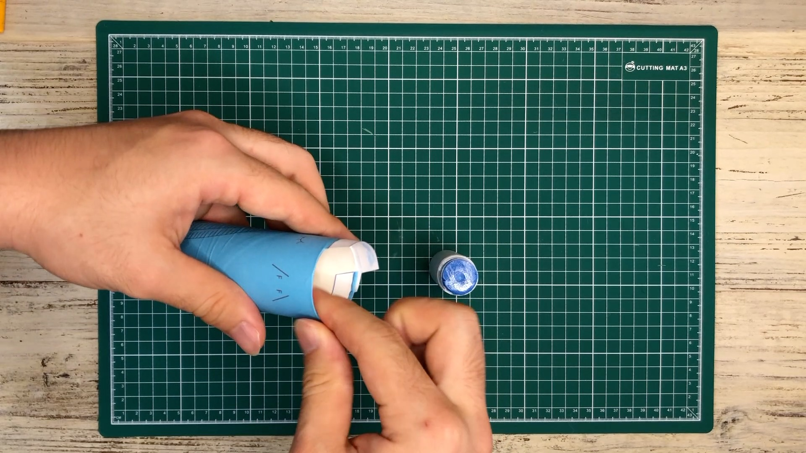
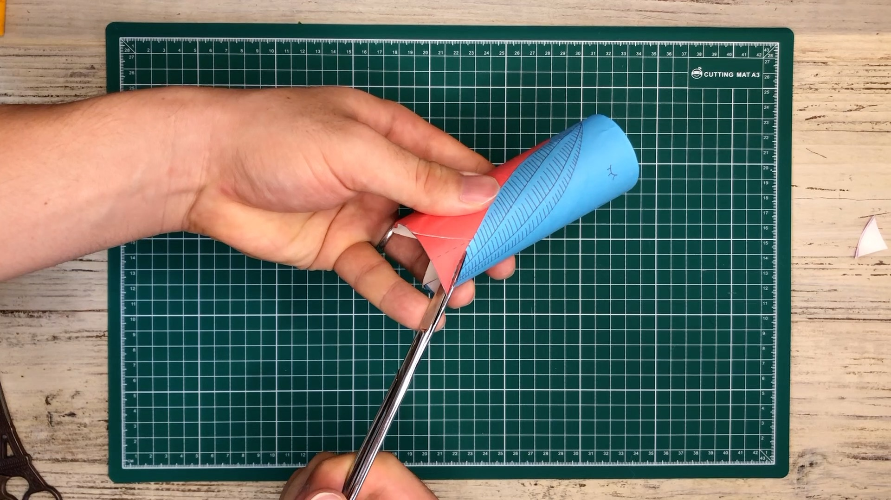
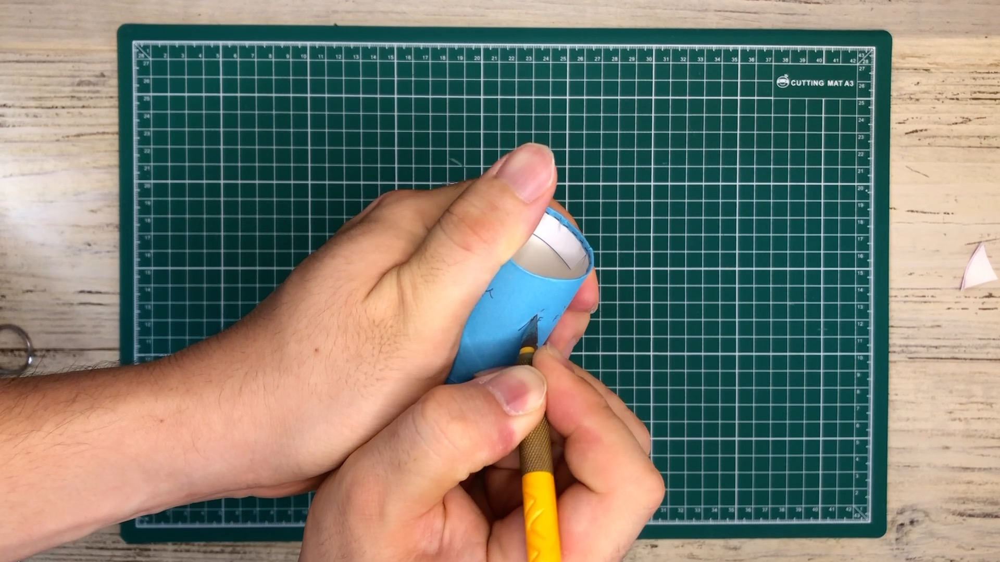

# Make a cover (body)

Build your own cover with flexible ideas! 

Share your cover on Twitter and Instagram with the hashtag #dio_product.

There are four sample templates that are easy to make using toilet paper cores.  

| File name | Photo | Difficulty level |
|-------|-------|-------|
| [bird.pdf](data/bird.pdf) |  | Medium |
| [flower.pdf](data/flower.pdf) |  | Easy |
| [plant.pdf](data/plant.pdf) |  | Easy |
| [spring.pdf](data/spring.pdf) |  | Easy |

As a sample, here is how to make a bird cover.  

### 1.
Download the pdf from the table above, and print it out in actual size on A4 paper.  

### 2.
Cut along the outer solid lines with scissors. 

### 3.
Make creases along the dotted lines.  

### 4.
Put glue on the back side, wrap a toilet paper core with it to attach it.  

### 5.
Put glue on the surface of part C, and attach it to the other end to form a tube.  

### 6.
Fold the top and bottom tabs inward and glue them to the core.  

### 7.
Cut out parts D and E with scissors. Save the cut-out part D.  

### 8.
Use a utility knife to make a slit along line F.  

### 9.
Insert both ends of D into F to make a beak to finish the cover. Place the device inside.  

 

