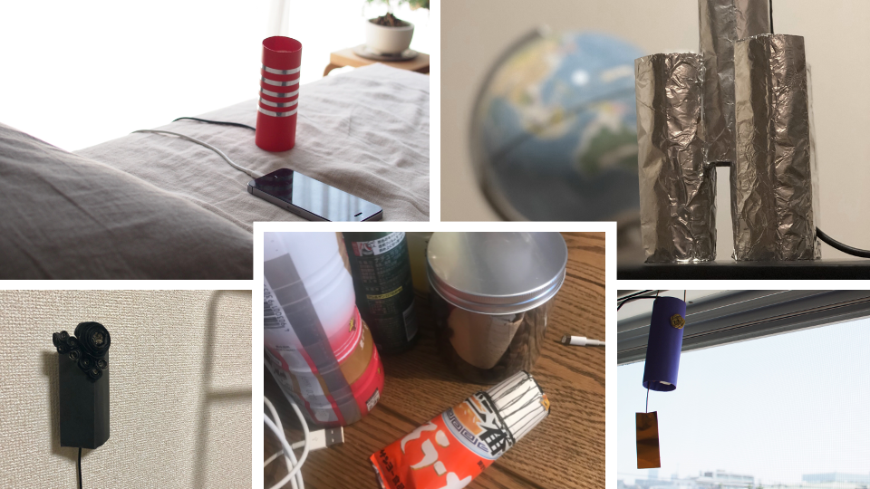

# 筐体（ケース）の作り方
筐体は皆さんのアイディアで自由に作ってみましょう！

ハッシュタグ #dio_product でTwitterやInstagramなどでどんどんシェアしてください。

サンプルとして、トイレットペーパーの芯を使って簡単に作れる4つのテンプレートを用意しています。

| ファイル名 | 画像 | 難易度 |
|-------|-------|-------|
| [bird.pdf](data/bird.pdf) |  | Medium |
| [flower.pdf](data/flower.pdf) |  | Easy |
| [plant.pdf](data/plant.pdf) |  | Easy |
| [spring.pdf](data/spring.pdf) |  | Easy |

ここではサンプルとして、birdの作り方を紹介します。

### 1.
上の表からpdfをダウンロードし、A4の紙に等倍で印刷してください。

### 2.
外側の実線に沿ってハサミで切り取ります。

### 3.
点線に沿って折り目をつけます。

### 4.
裏面をのり付けし、トイレットペーパーの芯を包むようにして貼り付けます。

### 5.
Cの部分の表面にのり付けし、反対側の端同士を貼り付けて筒状にします。

### 6.
上下の飛び出た部分を内側に折り込んで貼り付けます。

### 7.
D、Eの部分をハサミで切り取り、Dの部分は捨てずに残しておいてください。

### 8.
カッターでFの線に沿って切込みを入れます。

### 9.
Dの両端部をFに差し込み、くちばしを作ったら完成です。デバイスを中に入れてみましょう。

 

